# Linux.do 来源接入

## 定位与边界

Linux.do 是一个基于 Discourse 的内容来源，canonical slug 为 `linuxdo`。接入复用知乎 / Reddit 的浏览器任务模式：后端负责排队、预算、关键词与候选入池，已安装扩展在真实 `linux.do` 标签页里使用浏览器现有会话发起同源请求，再把裁剪后的主题字段回传给用户配置的 OpenBiliClaw 后端。

这条链路有四个硬边界：

- 对 Linux.do 的请求全部是 `GET`，不点赞、不收藏、不发帖、不回复，也不执行任何其它站内状态变更。
- 请求只允许 `https://linux.do` 同源 JSON endpoint；扩展不会让后端提供任意 URL，也不会跨域重放 Linux.do 会话。
- `_t` Cookie 只在扩展内判断“存在且非空”，后端只收到 `{"logged_in": true|false}`；Cookie 名下的值不会上传。
- 任务结果只包含归一化后的主题字段和结构化错误；Cookie、CSRF 字段、完整响应正文及未裁剪的原始 JSON 都不会上传。

公开 discovery 不要求登录。个人书签、点赞和阅读记录属于可选增强，必须在同一浏览器已登录 Linux.do，并由 `/session/current.json` 返回 `current_user.username` 正面确认当前身份；仅看到 `_t` 不足以开始个人数据分页。

## 数据流

```mermaid
flowchart LR
    Soul[Soul / unified keyword planner] --> Producer[LinuxdoDiscoveryProducer]
    Producer --> Queue[(linuxdo_tasks)]
    Queue -->|GET /api/sources/linuxdo/next-task| Dispatcher[Extension dispatcher]
    Dispatcher --> Tab[isolated linux.do task tab]
    Tab -->|same-origin, credentials: include, GET only| JSON[Linux.do JSON endpoints]
    JSON --> Normalize[bounded topic normalization]
    Normalize -->|no cookie or raw response| Result[POST /api/sources/linuxdo/task-result]
    Result -->|discovery| Pending[(discovery_candidates / pending_eval)]
    Result -->|bootstrap| Events[(durable events)]
    Events --> Profile[ProfileUpdatePipeline]
    Pending --> Eval[shared evaluator / admission]

    Cookie[_t cookie existence] --> Bool[logged_in boolean only]
    Bool --> Heartbeat[POST /api/sources/linuxdo/login-state]
    Heartbeat --> Auth[optional-login source-auth contract]
```



扩展通过 `authenticatedFetch` 访问后端任务端点，因此本机默认路径与启用 device-key 的自托管路径共享同一认证契约。普通 Linux.do 页面会启动 `linuxdoAdapter` 的统一行为 collector；任务 tab 使用稳定 query marker `?openbiliclaw_linuxdo_task=1`，content script 看到该标记后只安装 task executor、不启动普通行为采集，避免一次 discovery/bootstrap 被误记为用户浏览事件。为兼容旧任务 tab，识别逻辑仍接受旧 hash marker，但 dispatcher 不再生成它：真实 E2E 证明 Discourse SPA 会在 `document_idle` 前清除 hash。

## 五种 discovery 模式

`[sources.linuxdo].source_modes` 可从下列五种只读分支中选择：

| mode | Linux.do GET | 归一化 strategy | 输入 / 种子 |
|---|---|---|---|
| `search` | `/search.json?q=<keyword>&page=<n>` | `linuxdo-search` | 统一关键词 planner claim；结果保留 `source_keyword_id` |
| `hot` | `/hot.json?page=<n>`；仅在 400/404 时回退 `/top.json?period=weekly&page=<n>` | `linuxdo-hot` | 无需登录 |
| `feed` | `/latest.json?page=<n>` | `linuxdo-feed` | 无需登录 |
| `creator` | `/topics/created-by/<username>.json?page=<n>` | `linuxdo-creator` | 最近任务/候选里的 `author_url`，同轮结果可兜底 |
| `related` | 先读 `/t/<topic_id>.json` 的标题/首帖，再调用 `/topics/similar_to.json?title=...&raw=...` | `linuxdo-related` | 最近 Linux.do 主题 URL，同轮结果可兜底；过滤 seed 自身 |

所有分支输出同一 topic schema：

```json
{
  "scope": "linuxdo_search",
  "content_type": "post",
  "topic_id": "12345",
  "content_id": "topic:12345",
  "title": "主题标题",
  "url": "https://linux.do/t/example/12345",
  "author": "alice",
  "author_url": "https://linux.do/u/alice/activity/topics",
  "summary": "裁剪后的纯文本摘要",
  "category": "开发调优",
  "tags": ["linux", "python"],
  "views": 100,
  "like_count": 12,
  "reply_count": 8,
  "published_at": "2026-08-09T00:00:00.000Z",
  "source_strategy": "linuxdo-search"
}
```

后端以 `topic_id` 为首选稳定身份，并兼容从 `content_id` 或 Linux.do topic URL 恢复 ID；canonical `content_id` 始终为 `topic:<id>`，`content_type` 始终为 `post`。`tags` 保持数组，`category` 是独立标量；上游实际提供时，`views` / `like_count` / `reply_count` 进入统一 engagement 字段，缺失时不伪造。真实 `/search.json` 和 `/topics/similar_to.json` 可能省略主题 OP、浏览量与主题总赞，匹配 post 的作者、点赞和时间又不能代表主题字段。正式 producer 因此给 search / related 下发全局 `max_items`，executor 只对最终保留的 topic ID 请求 `/t/<id>.json`，补齐主题作者、浏览、总赞和回复；详情失败会返回 degraded，绝不回退到回复字段或假 `0`。候选只写 `discovery_candidates`，由共享 evaluator 与来源配额决定是否入推荐池。

## 三种 bootstrap scope

`bootstrap_events` 先调用 `/session/current.json` 确认当前用户，再按任务允许的 scope 读取：

| scope | Linux.do GET | 统一事件 | 默认信号强度 |
|---|---|---|---|
| `linuxdo_bookmarks` | `/u/<me>/bookmarks.json?page=<n>` | `favorite` | `0.90` |
| `linuxdo_likes` | `/user_actions.json?username=<me>&filter=1&offset=<n>` | `like` | `0.85` |
| `linuxdo_read_history` | `/read.json?page=<n>` | `view` | `0.35` |

初始化时这三类事件与其它已选择来源一起进入首版画像。画像已存在后，扩展在线的周期回拉仍使用同一任务类型，但默认由 `scheduler.source_incremental_enabled=false` 全局关闭；显式开启后才按周期运行，并通过 canonical staged result、durable event ingress 和 `linuxdo_seen_item_keys` 去重。每源只保留最新 5,000 个 seen key。`fetch-linuxdo` 默认仅做 smoke，只有显式 `--write-memory` 才把本轮事件写入 memory，且不受周期总开关影响。

三个 scope 都成功但无条目时是 `empty`；部分 scope 成功、部分 scope 返回结构化错误时是 `degraded`，已得到的有效事件仍保留并可参与本轮画像，但该终态不是“完整采集”证据。全部 scope 失败才是 `failed`。默认 6 小时近期任务去重只复用在途任务和成功的 `ok/empty` 终态；`failed/degraded` 不复用，下次会重新入队尝试补齐。

## 任务与 API 契约

| 方法与路径 | 用途 |
|---|---|
| `GET /api/sources/linuxdo/next-task` | 原子领取最早的 pending 任务；无任务返回 bodyless 204，约 35 分钟未完成的 claim 才进入崩溃重领窗口，长任务不会被过早偷走 |
| `POST /api/sources/linuxdo/task-result` | 合并 partial/canonical 结果并完成 discovery 或授权的 bootstrap 事件投影 |
| `POST /api/sources/linuxdo/kick` | 通过 runtime-stream 广播 `linuxdo_task_available`，立即唤醒扩展轮询 |
| `POST /api/sources/linuxdo/login-state` | 接收 `_t` 的布尔存在性；不接收 Cookie 值 |
| `GET /api/sources/status` | 返回 `auth_required=false` 的可选登录 source-auth 状态；心跳缺失时可只读最近 `linuxdo_tasks` 作间接证据，本端点不访问 Linux.do |

最终回调采用共享 staged-completion 协议：第一份 terminal payload 冻结为 canonical result，个人事件、seen-key 与其它投影成功后才翻转任务 terminal。重复或迟到回调不能替换已经冻结的结果；进程在投影中途退出时，租约重领可从同一 canonical result 幂等补齐。后端重新按原任务校验 scope、总量、每输入上限、关键词 ID、交互 action、cursor lane 和账号 key，扩展字段不能扩大任务权限。扩展会在执行前把 `{task, tab_id, deadline_at}` 临时写入 `chrome.storage.local`；该记录不含 Cookie 或原始响应，并在 backend ACK 后删除。包括非法任务、超时和 tab 失败在内的所有 claimed final 都会持久保存同一 payload 并重试，不会把一次非 2xx 当成已交付。MV3 worker 恢复时会先恢复 session 并启动 runtime-stream，再用 recovery barrier 阻止 polling 抢领新任务，因此等待共享 mutex 不会把连接一起卡死。`chrome.storage.session` generation 区分普通 worker recycle 与完整 extension reload：前者向存活的 content context 幂等重发，后者先刷新 runner-owned Linux.do 文档以获得新 listener，再重放同一只读 task ID；后端以 first-final 不可变契约保证终态幂等。

## 扩展安全与资源上限

- 生产任务的单个 Linux.do JSON 请求默认且最高为 30 秒；dispatcher 会把更大的 `fetch_timeout_ms` 作为非法 payload 立即回传失败，content executor 也独立把该值裁剪到 30 秒。
- discovery 生产任务默认且最多 5 页；bootstrap 会按 `max(5, ceil(bootstrap_limit / 20))` 自动扩页，因此 300 条 bookmarks 的默认页预算是 15，生产任务也最多 15 页。单 scope / keyword / seed 最多 300 条，search / creator / related 的输入列表最多 5 个；content executor 仍以 50 页 / 20 输入作第二层绝对防御，但合法队列任务不会触达这两个边界。
- CLI/producer 默认给 Linux.do 任务 32.5 分钟端到端总等待：其中 pending 最多约 3 分钟等扩展领取；进入 `in_progress` 后，dispatcher 按任务广度、页数和请求间隔给予最宽约 29 分钟执行窗口，再留 30 秒结果余量。后端 claim lease 约 35 分钟，给终态回传与 MV3 恢复留出缓冲。显式 `fetch-linuxdo --wait-seconds` 或 `OPENBILICLAW_LINUXDO_BOOTSTRAP_WAIT_SECONDS` 是从入队开始计算的总硬上限，例如 `180` 秒可能截断已经领取的任务。guided init 的 Stage-1 基础预算仍为 30 分钟；仅选择 Linux.do 且使用默认预算时至少给 32.5 分钟，同时选择 Linux.do 与其它来源时给 30 + 32.5 = 62.5 分钟，显式 override 原样生效、不扩容。
- 单响应最多 2 MiB；声明长度或实际正文超限都返回 `linuxdo_response_too_large`。
- URL 只接受 `https://linux.do`；topic ID 必须是正整数，creator / related 种子在请求前校验。
- HTTP 200 但正文是 HTML challenge、缺少/错误 JSON `Content-Type`、JSON 解析失败或容器结构不合格时，不把正文回传，只报告结构化失败；只有 route-specific envelope 与终止页证据齐全才允许 `empty`。
- dispatcher 对任务类型、scope 和数值字段做 allow-list 校验；领取后才发现非法 payload 时，会立即向 `task-result` 回传 `failed / invalid_task_payload`，不让坏任务占满整个长 lease。合法任务使用独立 tab ID、task ID 与绝对超时，结束后只关闭自己创建的标签页。
- Linux.do dispatcher 在领取后端任务前先获取共享 dispatcher mutex，避免多个扩展任务同时争用浏览器任务标签页；共享 mutex 的 stale 驱逐窗口为 36 分钟，长于合法任务的约 29 分钟执行窗口与 35 分钟 claim lease。
- 如果同源 task tab 在 Discourse challenge / SPA 初始化窗口里暂时没有 content-script listener，dispatcher 会继续在原 task ID 上做短间隔重试；达到 readiness 窗口后最多重载一次同一标签页，再重新等待 ready。重载仍失败才回传 `sendMessage_failed`，不会释放租约后偷偷领取第二个任务，也不会创建第二个 runner tab。
- bootstrap 任一 scope 或 discovery 的分页 / 多输入中途失败时，会保留此前已经归一化的 items 并回传 `degraded` 与有界 `scope_errors` / `input_errors`；只有没有任何有效 item 的失败才回传 `failed`。producer 会继续把 degraded discovery 的有效 topic 放入候选管线，并把本轮标成部分完成。
- 同一 bootstrap 任务里，若 bookmarks / likes / read history 的相同 `topic_id` 有任一路径提供真实 `views` / `like_count` / `reply_count`，executor 会把该任务内已有真值补到其它 scope 的缺失字段；已有值（包括显式 `0`）不覆盖，不跨 topic，也不额外请求详情页。

可观察错误包括 `linuxdo_login_required`、`linuxdo_access_blocked`、`linuxdo_rate_limited`、`linuxdo_upstream_unavailable`、`linuxdo_request_timeout`、`linuxdo_network_error`、`linuxdo_response_too_large` 和 `linuxdo_invalid_response`。回传 debug 只保留错误码、HTTP 状态和不含 query secret 的同源 path；不包含响应正文。搜索遇到限流、网络、超时、访问阻断或登录错误时，后端会回滚该轮关键词 claim，避免把暂时失败误记为已消费。

## 配置与 CLI

Linux.do 默认关闭；启用示例：

```toml
[sources.linuxdo]
enabled = true
source_modes = ["search", "hot", "feed", "creator", "related"]
daily_search_budget = 0
daily_hot_budget = 0
daily_feed_budget = 0
daily_creator_budget = 0
daily_related_budget = 0
request_interval_seconds = 3
min_interval_minutes = 3
bootstrap_limit = 300
```

`0` 的 daily budget 表示不按日预算限制该分支。daemon 自动补池仍受 source 开关、`[scheduler].enabled`、producer 间隔、候选池份额、分页/条数上限和扩展在线状态约束；显式 `discover-linuxdo` / `discover --source linuxdo` 只绕过 scheduler 后台总开关，来源开关、分支配置、预算、producer 间隔、候选池与扩展在线约束照常生效。

```bash
# 只读 smoke：等待扩展拉本人书签、点赞、阅读记录
openbiliclaw fetch-linuxdo

# 强制绕过近期任务复用；仍然只读 Linux.do，使用默认 32.5 分钟总等待
openbiliclaw fetch-linuxdo --force

# 明确授权写入本地 memory（不改变 Linux.do 站内状态）
openbiliclaw fetch-linuxdo --write-memory

# 按 source_modes 触发一次正式 discovery
openbiliclaw discover-linuxdo --limit 30

# 通用入口
openbiliclaw discover --source linuxdo --limit 30
```

## Source-auth 语义

Linux.do 的 legacy `auth_required` 恒为 `false`，但 `auth.capabilities` 明确拆开能力：`discover=anonymous/ready`，`profile/bootstrap/incremental=login-required`。因此未登录不能把 search / hot / feed / creator / related 宣称为不可用，也不能让只依赖 Linux.do 个人信号的 guided init 越过登录前置。扩展最近确认 `_t` 存在时，契约以 `credential_origin="extension"`、`verify_method="browser_heartbeat"` 表示个人信号通路可尝试，但仍是 observed/unverified；真正执行个人任务时必须由 `/session/current.json` 正面确认。72 小时内的个人任务 `login_required` 是更强证据，不会被后到的 Cookie-exists 心跳冒充成已验证；个人任务成功才恢复 verified。历史任务超过 72 小时后降为 stale/unverified，不会永久准入或拦截。若从未收到心跳，状态 provider 会以最近 `linuxdo_tasks` 作 `task_history` 回落：新鲜的个人 bootstrap 成功才表示可选会话已验证，公开 discovery 成功只表示匿名链路可用，绝不伪造登录态。

设置页的“测试连接”会通过 runtime-stream 请求扩展重新上报布尔登录状态。这是浏览器心跳证据，不等同于后端持有或验证 Cookie；真正执行个人 bootstrap 时仍以 `/session/current.json` 的正面身份为准。

## 验证状态与已知限制

2026-08-09 已用本机实际加载的 Chrome unpacked extension 和真实已登录 Linux.do 会话完成只读 E2E；2026-08-10 又对当前 worktree 做了隔离后端热加载复验：

1. 热重载端点返回 `delivered=true`，扩展启动后登录心跳显示 optional credential `present / verified`；个人任务随后以 `/session/current.json` 正面确认当前会话。连接验证第一次实时执行、紧接着第二次命中 10 秒去抖 replay。
2. 两次画像增量 bootstrap 均得到 bookmarks 2、likes 5、read history 100，共 107 个完全相同的 canonical scope key；第二轮没有新增 event，107 个 ingest key 仍各只出现一次，seen-key 投影也保持 107。同一任务内、同一 topic 跨 scope 已有的 engagement 真值会回填到缺失分支；没有任一路径提供时继续保持 unavailable，不伪造 `0`。全部条目通过 scope、正整数 `topic_id`、`content_id="topic:<id>"`、`content_type="post"` 与 canonical `https://linux.do/t/...` 断言；结果树不含 `_t`、Cookie、token、authorization、原始响应或响应正文。
3. 原始任务真实返回 search 50（两个 Unicode 关键词各 25）、hot 40、feed 40、creator 29；旧 `suggested_topics` 路径在真站可合法为空且语义不是 seed 相似，现已改为官方 `/topics/similar_to.json`，自动 fixture 覆盖非空、过滤 seed、嵌套作者和 404+有效 seed 的 degraded preservation。另用真实 404 与“一个有效 creator + 一个非法输入”确认 `failed` / `degraded` 分支、partial preservation 和 first-final-wins；修复后的 `similar_to` 仍需随最终安装产物重新做一次真实账号 E2E。
4. search / hot / feed / creator / related 五种正式 producer 均单独走完真实模型评估；组合运行严格截断到全局 `limit=10`，随后重复 hot 供给命中 durable candidate/cache 去重，候选总量和 key digest 均不变，且没有遗留 `pending_eval / evaluating`。
5. E2E 暴露了旧 hash marker 会被 Discourse SPA 清除的问题，可能让任务 tab 误启动普通 collector。dispatcher 改用稳定 query marker 后再次执行真实 feed 任务，Linux.do 行为事件计数前后增量为 0；普通 Linux.do 页面仍能产生预期 snapshot / scroll。针对 2026-08-10 暴露的恢复卡死，修复后再用当前 Chrome worktree build 运行两页 feed：任务进入 `in_progress` 后触发完整 extension reload，runtime stream 两次成功建立，同一 task ID/单一任务行约 25 秒 terminal=ok，返回 37 个不重复 topic，且无遗留 active task。
6. 扩展全量 1323/1323、TypeScript typecheck、Chrome/Firefox build 与两端 17/17 资产校验通过。真实 search 2/2、related 2/2 候选均经 topic detail 得到作者、浏览、总赞、回复，解决了此前 unavailable 的分支差异；桌面 Web 与移动 Web 已检查 Linux.do 文字卡、作者、分类、日期和互动数展示。Firefox 尚未做同等真实账号安装版 E2E，因此只声明构建和自动化验证完成。

真实验收期间没有调用发帖、回复、点赞、收藏、已读 timing 等写接口；所有站点任务仍只有同源 GET。线上 schema 会随 Discourse/LINUX DO 升级而变化，结构化错误、`degraded` 与 partial preservation 仍是发布后的必要防线。
